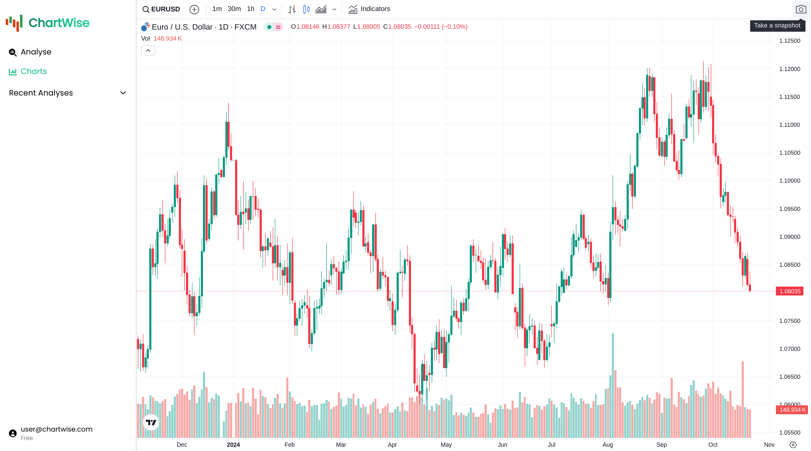
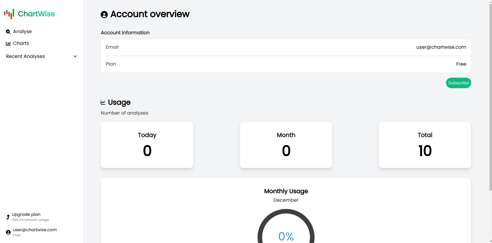

# ChartWise: A Practical Tool for Better Trading

---

ChartWise is a practical tool designed to help traders improve their trading execution by simplifying the process of chart analysis and trade planning. Whether you're trading forex, stocks, or cryptocurrency, ChartWise aims to bridge the gap between identifying good trade opportunities and executing them effectively.

---

## Features

1. **Chart Analysis**
   - Upload screenshots of your trading charts.
   - Input details about your trading strategy and risk tolerance.
   - Receive detailed analysis leveraging advanced technical analysis and AI.

2. **Trade Planning**
   - Generate actionable trade plans based on your inputs.
   - Tailored execution strategies to match your trading goals.

3. **User-Friendly Interface**
   - Intuitive design for both beginners and experienced traders.
   - Structured layouts for chart analysis, account management, and trade insights.

---

## Why Use ChartWise?

ChartWise was created to solve a common problem in trading: the difficulty of executing trades effectively despite having the right strategy. Key benefits include:

- **Enhanced Execution**: Turn your trading insights into well-executed trades.
- **Actionable Insights**: Avoid common mistakes by following structured and reliable trade plans.
- **Versatile Utility**: Designed for both new traders and seasoned professionals looking to refine their strategies.

---

## How It Works

1. **Upload Your Chart**: Start by uploading a screenshot of your chart.
2. **Define Your Strategy**: Input details about your trading approach and risk tolerance.
3. **Get Your Plan**: Receive a detailed analysis and execution plan customized to your inputs.

---

## Getting Started

1. Visit [ChartWise](https://chartwise.fpflabs.app).
2. Create an account or log in.
3. Begin analyzing your charts and generating trade plans.

---

[Try ChartWise now!](https://chartwise.fpflabs.app)

